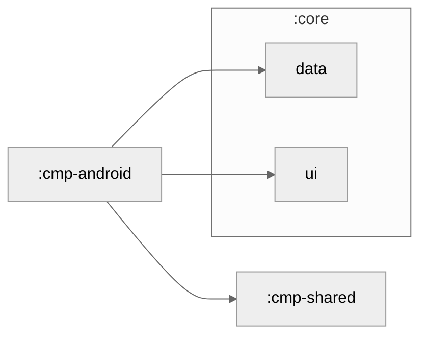

### Module Graph

```mermaid
%%{
  init: {
    'theme': 'neutral'
  }
}%%

graph LR
  subgraph :core
    :core:data["data"]
    :core:ui["ui"]
  end
  :cmp-android --> :cmp-shared
  :cmp-android --> :core:data
  :cmp-android --> :core:ui
```