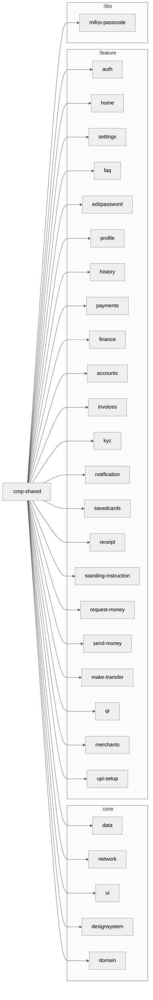

### Module Graph

```mermaid
%%{
  init: {
    'theme': 'neutral'
  }
}%%

graph LR
  subgraph :core
    :core:data["data"]
    :core:network["network"]
    :core:ui["ui"]
    :core:designsystem["designsystem"]
    :core:domain["domain"]
  end
  subgraph :feature
    :feature:auth["auth"]
    :feature:home["home"]
    :feature:settings["settings"]
    :feature:faq["faq"]
    :feature:editpassword["editpassword"]
    :feature:profile["profile"]
    :feature:history["history"]
    :feature:payments["payments"]
    :feature:finance["finance"]
    :feature:accounts["accounts"]
    :feature:invoices["invoices"]
    :feature:kyc["kyc"]
    :feature:notification["notification"]
    :feature:savedcards["savedcards"]
    :feature:receipt["receipt"]
    :feature:standing-instruction["standing-instruction"]
    :feature:request-money["request-money"]
    :feature:send-money["send-money"]
    :feature:make-transfer["make-transfer"]
    :feature:qr["qr"]
    :feature:merchants["merchants"]
    :feature:upi-setup["upi-setup"]
  end
  subgraph :libs
    :libs:mifos-passcode["mifos-passcode"]
  end
  :cmp-shared --> :core:data
  :cmp-shared --> :core:network
  :cmp-shared --> :core:ui
  :cmp-shared --> :core:designsystem
  :cmp-shared --> :core:domain
  :cmp-shared --> :feature:auth
  :cmp-shared --> :libs:mifos-passcode
  :cmp-shared --> :feature:home
  :cmp-shared --> :feature:settings
  :cmp-shared --> :feature:faq
  :cmp-shared --> :feature:editpassword
  :cmp-shared --> :feature:profile
  :cmp-shared --> :feature:history
  :cmp-shared --> :feature:payments
  :cmp-shared --> :feature:finance
  :cmp-shared --> :feature:accounts
  :cmp-shared --> :feature:invoices
  :cmp-shared --> :feature:kyc
  :cmp-shared --> :feature:notification
  :cmp-shared --> :feature:savedcards
  :cmp-shared --> :feature:receipt
  :cmp-shared --> :feature:standing-instruction
  :cmp-shared --> :feature:request-money
  :cmp-shared --> :feature:send-money
  :cmp-shared --> :feature:make-transfer
  :cmp-shared --> :feature:qr
  :cmp-shared --> :feature:merchants
  :cmp-shared --> :feature:upi-setup
```