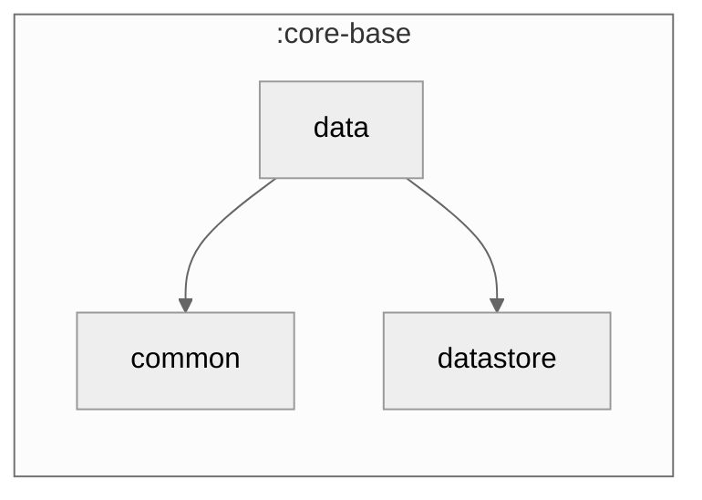

### Module Graph

## Framework-shared data infrastructure

`core-base/data` is NOT the repository layer (that's `core/data`) — it's the small set of
cross-cutting primitives every repository/sync layer builds on:

- **`NetworkMonitor`** — typealias onto `cmp-network-monitor`'s connectivity interface; the
  `NetworkMonitorContract` object documents the invariants (StateFlow, synchronous initial value,
  debounce bounds) any substitute implementation must satisfy.
- **`TimeZoneMonitor`** — emits the device's current `TimeZone`, once at start and again on every
  OS timezone change (Android via `BroadcastReceiver`; other platforms via a single `flowOf`).
- **`Synchronizer` / `Syncable` / `NetworkChange`** — the sync contract (a Now-in-Android port):
  a `Syncable` repository implements `syncWith(synchronizer)`, invoked by a worker's `Synchronizer`.
  `changeListSync` (delta APIs) and `snapshotSync` (snapshot APIs) are the two ready-made algorithms.
- **`SyncManager`** — a minimal `isSyncing: Flow<Boolean>` + `requestSync()` observer contract for
  surfacing a global "Refreshing…" indicator.

Implementations (`NetworkMonitorImpl`, per-platform `TimeZoneMonitorImpl`) live in `impl/`; DI
wiring and the `Synchronizer` adopter live one layer up in `core/data` and `sync/`.
