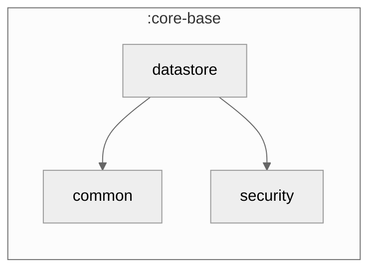

### Module Graph

## Two Settings instances + the sync bookkeeping primitive

`core-base/datastore` provides the raw key-value substrate (`multiplatform-settings`) that
`core/datastore`'s `UserPreferencesRepository` is built on:

- **`DatastoreBaseModule`** binds two Koin-qualified `Settings` instances — `named("plain")` for
  ordinary UI/UX prefs, `named("secure")` for anything sensitive (tokens, passcodes).
- **`SecureSettingsFactory`** (expect/actual) builds the `named("secure")` instance per platform:
  Android `EncryptedSharedPreferences` (AES256-GCM via `androidx.security.crypto`), iOS Keychain,
  Desktop AES-encrypted properties, Web in-memory (v1).
- **`ChangeListVersions`** + **`SyncStatePersister`** — the persisted half of the
  `core-base/data` `Synchronizer` contract: a per-feature `Map<String, Long>` of last-synced
  versions/timestamps, read/written through the `named("plain")` `Settings` instance.

Nothing here is fork-branded — a fork's own preference groups live in `core/datastore`'s
`UserPreferencesRepository`, built on top of the `plain`/`secure` `Settings` this module provides.
