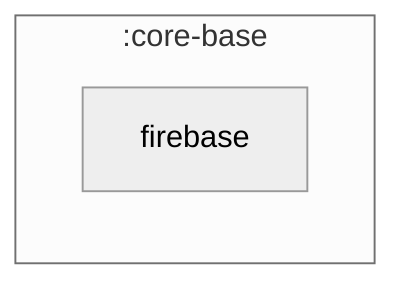

### Module Graph

## The real Firebase-backed analytics binding

`core-base/firebase` is the template-owned **host** module — it re-exports the published
`cmp-firebase` (+ `cmp-firebase-compose`) library and binds its **production** `AnalyticsHelper` +
`PerformanceTracker`:

- **`firebaseModule`** — `single<AnalyticsHelper>` via `AnalyticsModule.analyticsHelper(mode =
  AnalyticsModule.Mode.Firebase, config = AnalyticsConfig())`, plus `single { AnalyticsModule
  .performanceTracker(get()) }`. This is the "analytics ON" binding — a fork includes it to talk
  to real Firebase (GitLive on supported targets, Measurement-Protocol/NoOp fallback elsewhere).

By contrast, `core/firebase` (the project layer) binds the **NoOp default** (privacy-respecting
open-source build) plus the app-owned domain event catalogue (`KptAnalyticsTracker`). Koin's
last-binding-wins resolution means a fork switches from NoOp to real Firebase by including
`firebaseModule` instead of, or after, `core/firebase`'s `coreFirebaseModule` — see
`core/firebase/README.md` for the full seam and `CONSUMPTION.md` here for the call sequence.

No Compose plugin is applied at this module — it has no `@Composable` of its own; Compose-facing
consumers (`cmp-navigation`, `feature/*`) pull `cmp-firebase-compose` transitively.
