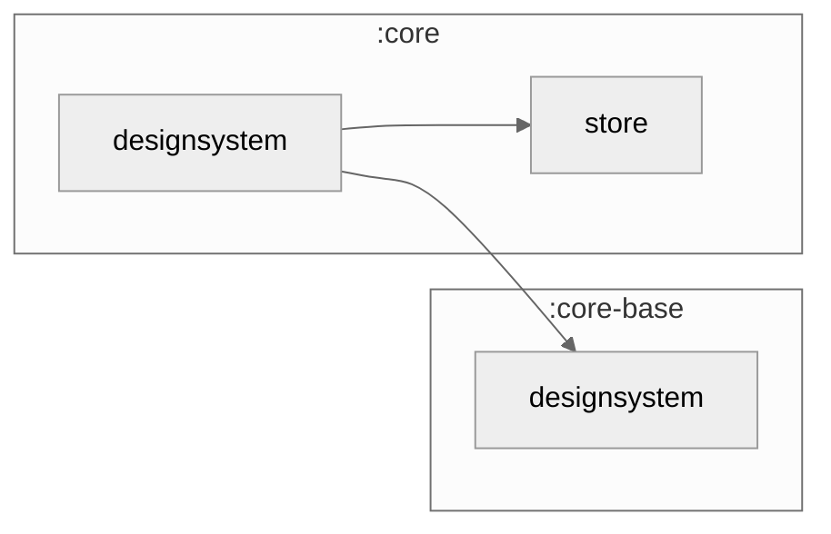

### Module Graph



## What lives here

`core/designsystem` is the brand layer **above** `core-base/designsystem` — it wraps the
framework-shared Material 3 primitives in the app's own theme and adds finance-domain tokens +
composables that `core-base` doesn't know about.

- **`KptTheme`** — the app-wide theme composable. Wraps `core-base/designsystem`'s
  `KptMaterialTheme`, builds the light/dark `ColorScheme`, and provides the extra
  CompositionLocals below so every screen wrapped in it resolves branded tokens with zero
  per-call wiring — including `LocalScreenStateDefaults` (from `core/store`), so `ScreenContent` /
  `PagingScreenContent` automatically pick up the fork's branded empty/error/loading visuals.
- **Token extension objects** — `FinanceColors` (`MaterialTheme.finance`, money/rate/freshness/
  urgency semantic colors), `Spacing` (`MaterialTheme.spacing`, 4/8/12/16/24/32/48 scale),
  `Elevation`, and `ChartTokens` (shared chart palette/typography, reads from the two above).
- **Per-domain composables that consume the tokens** — `MoneyText` / `AmountDisplay` (sign-aware
  currency rendering), `StatusChip` / `RateBadge` / `UrgencyDot` (state-at-a-glance pills),
  card-loading/error state widgets (`CardStateBox`, `CardLoadingSkeleton`, `RowLoadingShimmer`,
  `ErrorChip`, `InlineErrorPill`), and the `chart/` package (`KptAreaChart`, `KptBarChart`,
  `KptDonutChart`, `KptCandlestick`, `KptSparkline`).
- **`AppIcons`** — the shared `ImageVector` catalogue.

## Fork customization

Override any token subset without forking a widget — provide your own `FinanceColors` /
`Spacing` above `KptTheme`:

```kotlin
CompositionLocalProvider(LocalFinanceColors provides myForkFinanceColors()) {
    KptTheme { App() }
}
```

See `CONSUMPTION.md` for the full call sequence and `FEATURE_AUTHORING.md` +
`docs/architecture/STYLE_GUIDE.md` for when a new widget belongs here vs. `core-base/designsystem`
vs. `feature/{F}`.
