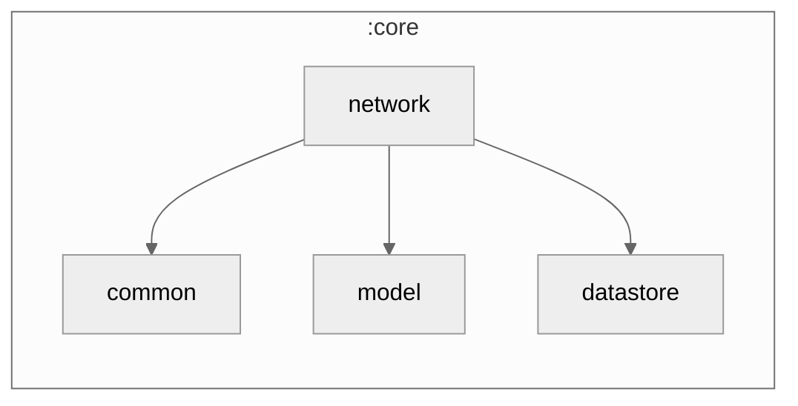

### Module Graph

## Access points — N REST + N Supabase

Every endpoint the app talks to is declared once in `app-profile/app.yaml#network.access_points`
(`type: rest | supabase`), generated into `AppAccessPoints.points`, and registered as
`AccessPointRegistry(AppAccessPoints.points)` in `NetworkModule`. The registry supports any number of
REST **and** Supabase points:

- **REST** — write the API interface, then one `restApi<T>("<id>")` line;
  `AccessPointRegistry.restBaseUrl(type)` resolves the base URL. `core-base/network` owns the transport.
- **Supabase** — `AccessPointRegistry.supabasePoints()` returns every declared Supabase point; a
  per-point `SupabaseConfigClient` factory builds the client (URL from the registry, key from secrets
  by id). `supabasePoints()` supports N Supabase projects — there is no single hardcoded client.

This is the single source of truth for "which servers this app talks to".