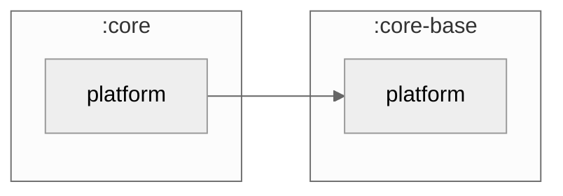

### Module Graph



## What lives here

`core/platform` is a **thin re-export boundary, not a code-bearing module** — it currently carries
no Kotlin source, only a `build.gradle.kts` that declares one dependency:

```kotlin
commonMain.dependencies {
    api(projects.coreBase.platform)
}
```

Its purpose is encapsulation (`G-CORE-BASE-ENCAP`): app-shell modules (`cmp-navigation`,
`cmp-shared`, `cmp-android`, …) reach the `core-base/platform` surface — `platformModule`,
`GarbageCollectionManager`, `tryCollect` — through `core/platform`, never by depending on
`core-base/platform` directly. The `api(...)` declaration re-exports that surface transitively, so
consumers only ever add `implementation(projects.core.platform)`.

It is also the designated home for **fork-owned platform code** — `expect`/`actual` bridges a fork
adds for a capability `core-base/platform` doesn't already cover (permission requesters,
biometrics, deep-link openers, share-sheet openers, calendar-event creators, notification
schedulers). None exist yet; when a feature needs one, it's authored directly in this module's
`src/{androidMain,iosMain,desktopMain,...}` source sets.

See `CONSUMPTION.md` for how to add one, and `docs/architecture/ARCHITECTURE.md` /
`SOURCE_SET_HIERARCHY.md` for the `core` vs. `core-base` split this module exists to enforce.
