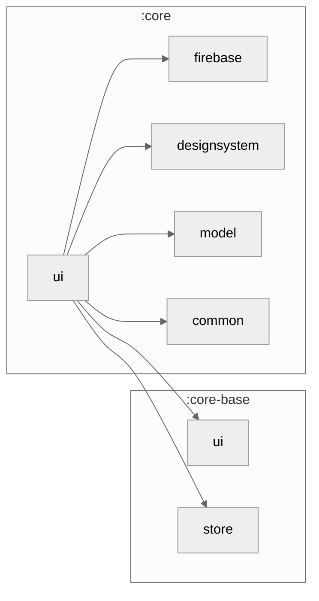

### Module Graph

## What lives here

`core/ui` is the app-level layer of reusable Compose primitives that every `feature/{F}` composes
— screen chrome and cross-feature widgets, not design tokens (those live in `core/designsystem`)
and not Store5-state-rendering primitives (`ScreenContent` etc. live in `core-base/ui`, re-exported
`api` through this module so features never depend on `core-base/ui` directly).

- **`KptScaffold`** (`scaffold/`) — the app's screen shell: top bar, FAB, snackbar host,
  window-inset handling, and pull-to-refresh wiring (`KptPullToRefreshState`).
- **`KptBottomBar`** / `KptNavigationRail` (`bottombar/`) — bottom navigation chrome that renders
  a list of `NavigationItem`s.
- **`NavigationItem`** — the value contract (`selectedIcon`, `icon`, `labelRes`,
  `contentDescriptionRes`, `graphRoute`, `startDestinationRoute`, `testTag`) a feature implements
  to register a tab.
- **Input widgets** (`input/`) — `PasswordStrengthIndicator` + `PasswordChecker`/`PasswordStrength`
  (strength meter), `RevealSwipe` (swipe-to-reveal row actions).
- **`JankStatsExtensions`** (`androidMain`) — Android frame-jank instrumentation hook.

## Fork customization

A feature-specific composite that no other feature reuses stays in `feature/{F}`; promote it here
only once a second feature needs it.

See `CONSUMPTION.md` (already present) for the full call sequence, and
`docs/architecture/ARCHITECTURE.md` / `SOURCE_SET_HIERARCHY.md` for how this module sits relative
to `core-base/ui` and `core/designsystem`.
